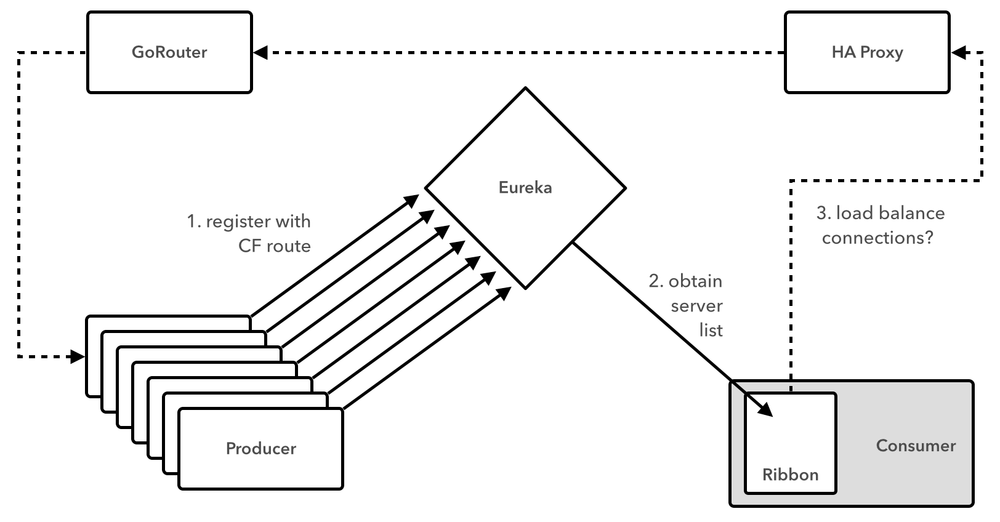
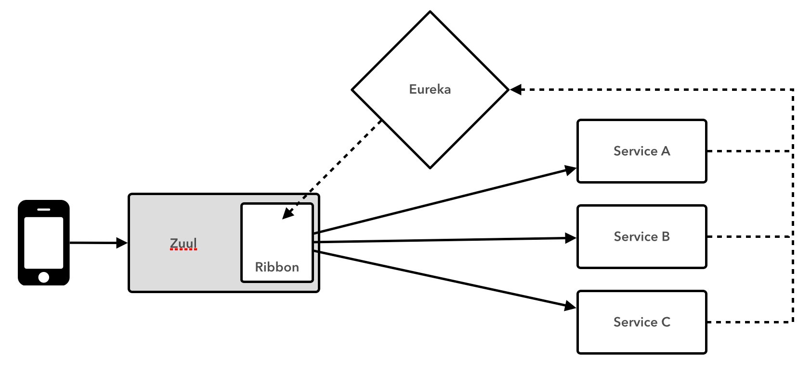

slidenumbers: true

# [fit] Deploying _*Microservices*_ to


---


# Me

_Matt Stine_ [@mstine](http://twitter.com/mstine)
_Principal Software Engineer_
_Pivotal_
[mstine@pivotal.io](mailto:mstine@pivotal.io)

---


# I wrote a little cloud book...

_FREE - Compliments of Pivotal_

[http://bit.ly/cloud-native-book](http://bit.ly/cloud-native-book)

# _Attack the Pivotal booth to get a print copy!_

---

> Now that you have Cloud Foundry, what are you going to do with it?

---

# [fit] _If you're_ smart_, start with a_
# [fit] MONOLITH_._

---


# [fit] _Make it 12 Factor_

---


# [fit] _Eventually things get bigger..._

---


# ...and it becomes time to _decompose_.

---

# [fit] _Microservices?_


---

> Loosely coupled service oriented architecture with bounded contexts...
-- Adrian Cockcroft

---

#You must be this tall to use Microservices


* _RAPID PROVISIONING_
* _BASIC MONITORING_
* _RAPID APPLICATION DEPLOYMENT_
* _DEVOPS CULTURE_

[http://martinfowler.com/bliki/MicroservicePrerequisites.html](http://martinfowler.com/bliki/MicroservicePrerequisites.html)

---

# A Symbiotic Relationship


---

# Platform Features

* _Environment Provisioning_
* _On-Demand Scaling_
* _Failover/Resilience_
* _Routing/Load Balancing_
* _Data Service Operations (BOSH)_
* _Monitoring_

---

# [fit] No Microservice
# [fit] is an _Island_


---

# Some Challenges of Distributed Systems

* _Configuration Management_
* _Service Registration & Discovery_
* _Routing & Load Balancing_
* _Fault Tolerance_
* _Monitoring_

---

> We need a representation of the **_composite_** system!

---

# [fit] The BIG _A_ App

---

```
---
memory: 512M
instances: 1
no-route: true
services:
  - cloudamqp-autoscale
applications:
- name: worker-process
  path: worker-process/build/libs/worker-process.jar
- name: producer-process
  path: producer/build/libs/producer.jar
- name: autoscaler-process
  path: autoscaler/build/libs/autoscaler.jar
- name: autoscale-monitor
  no-route: false
  host: autoscale-monitor-${random-word}
  path: monitor/build/libs/monitor.jar
```

^ The manifest is not sufficient...

---

# [fit] Static
# [fit] _vs._
# [fit] Dynamic

---

> Like BOSH, but for microservices?

---

# [fit] Decentralized
# [fit] _Autonomous_
# [fit] Capability
# [fit] _Teams / Services_

---


> You write it, you run it!

---


---


# [fit] Spring Cloud
# [fit] _Distributed System Patterns FTW!_

---

# [fit] App_/_Service
# [fit] _Level_
# [fit] _Patterns_

---

# [fit] _Deploying/Running Apps_
# [fit] vs.
# [fit] _Composing Fault Tolerant Systems_

---

# Spring Cloud + Netflix OSS

* _Config Server / Cloud Bus_
* _Eureka (_Service Registry_)_
* _Ribbon (_Load Balancer_)_
* _Hystrix (_Circuit Breakers_)_
* _Zuul (_Intelligent Routing_)_

---

# Works on Lattice too!


https://lattice.cf

---

# Config Server


---

# Config Server + Cloud Bus


---

# [fit] DEMO

---

# Eureka (_Service Registry_)


---

# [fit] DEMO

# Ribbon (_Load Balancer_)


---

# _Before_ cf\_release v204


---

# cf_release v195

```
"CF_INSTANCE_INDEX"=>"0",
"CF_INSTANCE_IP"=>"1.2.3.4",
"CF_INSTANCE_PORT"=>"5678",
"CF_INSTANCE_ADDR"=>"1.2.3.4:5678",
"CF_INSTANCE_PORTS"=>[{external:80,internal:5678}]
```

---

# cf_release v204

```
properties:
  dea_next:
    allow_host_access: true
```  

---

# _After_ cf\_release v204


---

# [fit] DEMO

---

# Hystrix (_Circuit Breaker_)


---

# [fit] DEMO

---

# Zuul (_Intelligent Routing_)



---

# [fit] DEMO

---

# Spring Cloud _FUTURES_

* _Alternative Stacks_ (Consul, Zookeeper, etcd, JRugged, ...)
* _Distributed Request Tracing/Correlation_ (i.e. Dapper/Zipkin)
* _Stateful Patterns_ (Leader Election, Locks, State Machine)
* _Developer Workflow Improvements_
* _Switches_ (Canaries, Feature Toggles, Surgical Routing, ...)
* _???_

---

# Learn _MOAR_

* [http://cloud.spring.io](http://cloud.spring.io)
* [http://spring.io/blog/2015/04/06/lattice-and-spring-cloud-resilient-sub-structure-for-your-cloud-native-spring-applications](http://spring.io/blog/2015/04/06/lattice-and-spring-cloud-resilient-sub-structure-for-your-cloud-native-spring-applications)
* [http://lattice.cf](http://lattice.cf)
* [http://netflix.github.io](http://netflix.github.io)

---

# THANK _YOU_

* _THIS TALK:_ [https://github.com/mstine/2015-cfsummit-deploying-ms-to-cf](https://github.com/mstine/2015-cfsummit-deploying-ms-to-cf)
* _DEMOS:_ [https://github.com/mstine/intro-spring-cloud-workshop/tree/lattice](https://github.com/mstine/intro-spring-cloud-workshop/tree/lattice)
